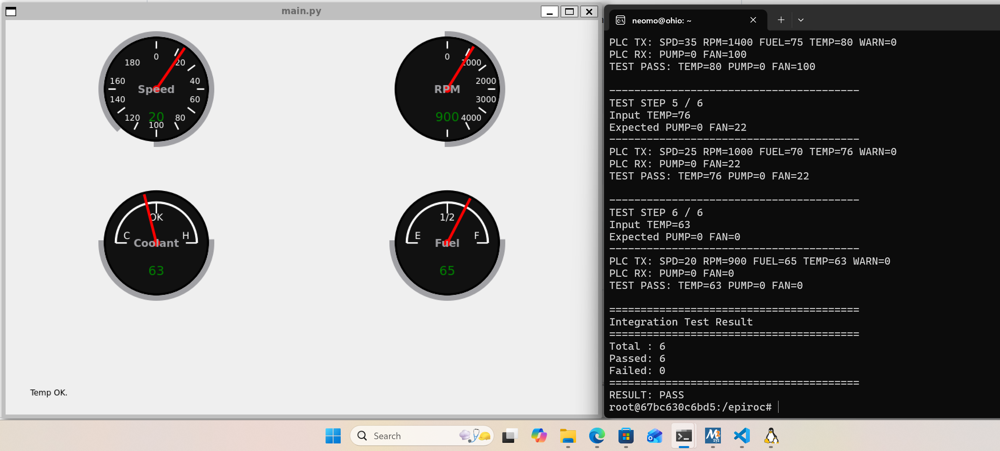

## Linux Setup

### Option 1: Run inside Docker

If you want to run the project inside a Docker container, start the container with CAN networking and GUI support:

```bash
docker run -it \
  --cap-add=NET_ADMIN \
  -e DISPLAY=$DISPLAY \
  -e WAYLAND_DISPLAY=$WAYLAND_DISPLAY \
  -e XDG_RUNTIME_DIR=$XDG_RUNTIME_DIR \
  -v /tmp/.X11-unix:/tmp/.X11-unix \
  -v /mnt/wslg:/mnt/wslg \
  IMAGE_ID \
  bash
```

Replace `IMAGE_ID` with your Docker image, for example:

```bash
amd64/gcc:latest
```

After running the command, you should be inside the container's Bash terminal.

> **Note:** The `/mnt/wslg` mount is intended for WSL2/WSLg. On a native Linux system, it may not be required.

### Option 2: Run directly on Linux or WSL2

If you are running directly on Linux or WSL2, you can skip the Docker step.

### Clone the Project

```bash
git clone https://github.com/neoteamer5/epiroc
cd epiroc
chmod +x SetupLinux.sh StartPLC.sh
```

### Step 1: Set Up the Environment

In the current Linux terminal:

```bash
./SetupLinux.sh
```

### Step 2: Start the PLC and Qt Dashboard

Open a **new Linux terminal** and run:

```bash
cd epiroc
./StartPLC.sh
```

If you are using Docker, the second terminal must enter the **same running container**, so it shares the same `vcan0` network interface.

For example, find the running container:

```bash
docker ps
```

Then enter it:

```bash
docker exec -it CONTAINER_ID bash
```

Go to the project directory and start the application:

```bash
cd epiroc
./StartPLC.sh
```

