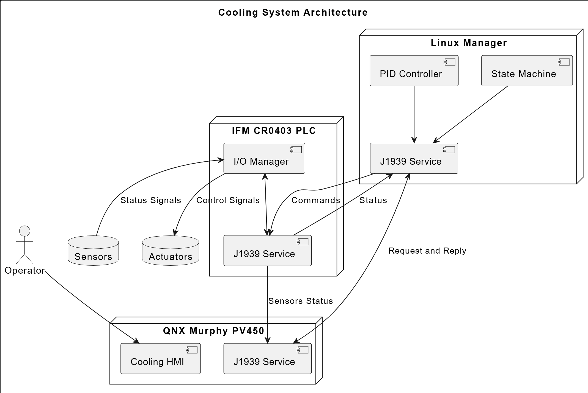

## Background Inroduction

We need to design a control system for an BEV cooling loop that contain componets of water pump, filter, fan, temperature sensor, inverter, converter, reservoir, level switch, and orifice.

The control system include MCU PLC, MCP Linux, and the communication network connecting the PLC and MCP. 

The communication network is CANBus.

The CANBus connects not only the controllers (PLC and MCP), it also connects QNX HMI.

The QNX HMI is another MCP but if it only controls the HMI display panel then it is just a CAN device node that will interact with the PLC and Linux.

The CANBus network might connects to other CAN node device or controllers.

## High Level Design

The MCP Linux is the manager of PLC. Manager shall receive status reports from PLC and send commands to PLC. Manager is able to interact with HMI.

PLC collect status signals from and send operation signals to cooling loop componets of water pump, filter, fan, temperature sensor, inverter, converter, reservoir, level switch, and orifice.

HMI display information to human and detect human's request operation. The display information has two sources, one is directly from the PLC, one is from the Linux. HMI is able to send human's request operation to the Linux where the requests will be validated. After validating the requests, the Linux is able to think how to command the PLC to fullfill the request and how to conclude a meaningful message that will inform the human.

## Cooling System Architecture

